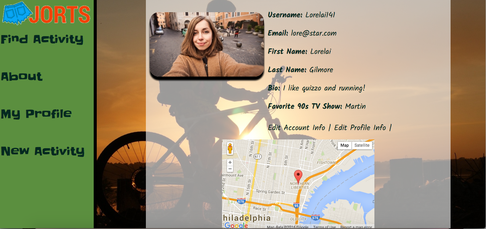
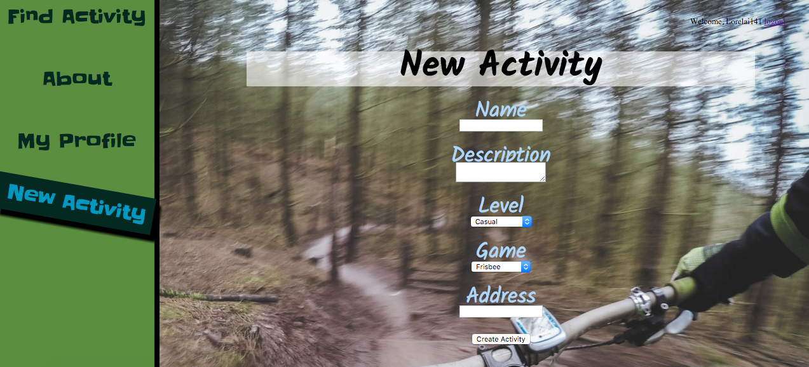
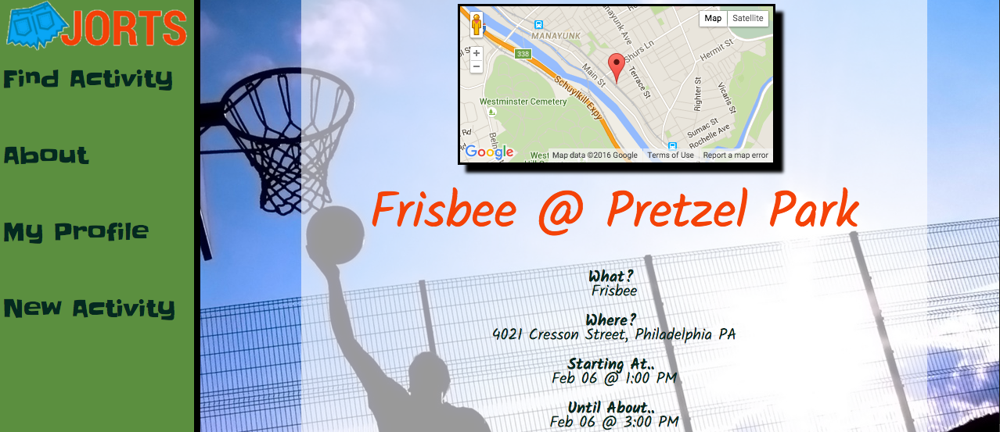

<!-- # Jorts_App
A location based app that allows users to find others in their area to do activities with. From throwing a frisbee around to intense pick-up basketball and even rounds of quizzo... Jorts want to help get you out of the house!  -->
<h1>Jorts</h1>
<h3>A different kind of pick up app.</h3>

The creators of JORTS, Dylan Weinberger & Emily McCracken, are residents of the Manayunk neighborhood of Philadelphia. Surrounded by green space and a desire to get out of the house but with a schedule that didn't allow participating in regularly scheduled sporting events, Dylan decided this was a problem that needed to be solved. This is where Jorts was ultimately born. Dylan & Emily wanted to create an easy and fun app that would allow users to create activities in their area while other users searched for them and joined. Users choose the type of activity and the level of intensity when creating a new activity.

Activities on JORTS range from casual frisbee games to intense pick-up basketball and even some competitive quizzo at a local bar! At JORTS, we want to do everything we can to make it as easy as possible to get out of the house and enjoy your favorite activities with other people! If you make new friends-- great! If you find a new sport you love-- awesome! If you find yourself spending more time outdoors and/or while exercising your body or brain-- best case scenario!

<h3>Use and Functionality</h3>

	Anyone can join Jorts as a User! You simply need to provide a username, password, and your email address and you are ready to get started! Once you sign up you will be taken to a page to fill out your profile. You can upload a profile picture, your name, a short bio, and your favorite 90's tv show and your address to show how far . If you don't like TV put in your favorite book. Or just leave it blank. Who cares?
	 
	
	 

	Once you are a member you can create new activities, join existing activities, and chat on the activities page.

<h3>Activities</h3>

	Activities are the bread and butter of Jorts. Each activity comes with a name, a description a level of intensity and a specific game type from a preloaded list, a time frame, and an address for the activity. You can start searching for activities to join by going to the find an activity page. This page will list all current and upcoming activities as well as a map displaying where these activities are. You can search for a specific address and the map and index will show all activities within a 5 mile radius. You can then click on the name of whatever activity you want to join.
	 
	
	 

	On the Activity page you will see where the activity is on the map at the top as well as the specific details about the event including the user who created said event. You will also have the option to RSVP for this event as well as look at a list of the current attendees. There will also be a comments section allowing you to chat about the event. All events will be removed from the database after the specified endtime.
	 
	
	 

